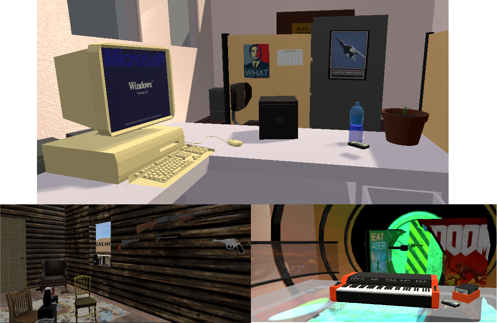

# Time Travel

> Voyagez dans le temps pour sauver le futur, dans cet escape game en réalité virtuelle.

## Prise en main

Ajouter le projet dans Unity Hub et lancez-le. Nos scripts sont dans `Scripts`, et nos modèles, textures, etc… sont dans `Resources`.

**NB**: La scène n'est pas complètement opérationnelle et il faut ré-attacher certains objets aux scripts.

## Documentation

* Rapports des années précédentes qui détaillent le scénario, les fonctionalités qui devraient être ajoutées, les bugs, etc… : ["G1 - Time Travel 2019.pdf"](https://github.com/MichelQu/TimeTravel/blob/3731b56716ae27b97d2aaadbef9642a4885d75bb/G1%20-%20Time%20Travel%202019.pdf) (2019) et 2020 (lien à ajouter).

* [Vue d'ensemble des scripts](docs/overview.md)

## À propos

Ce dépôt a été créé car nous n'avons pas pu modifier l'ancien. Il y a deux dépôt pour le rendu 2019: [ProjetCONAV](https://github.com/ViviFar/ProjetCONAV) qui est le git est cassé et [ProjetUnityV2](https://github.com/ViviFar/ProjetUnityV2) qui est fonctionnel, mais n'a pas l'historique. Nous avons fusionné ces deux historique dans le dépôt actuel.

Ce jeu est réalisé dans le cadre de l'option RV de Centrale Nantes. Il a été initialement conçu en 2019.
